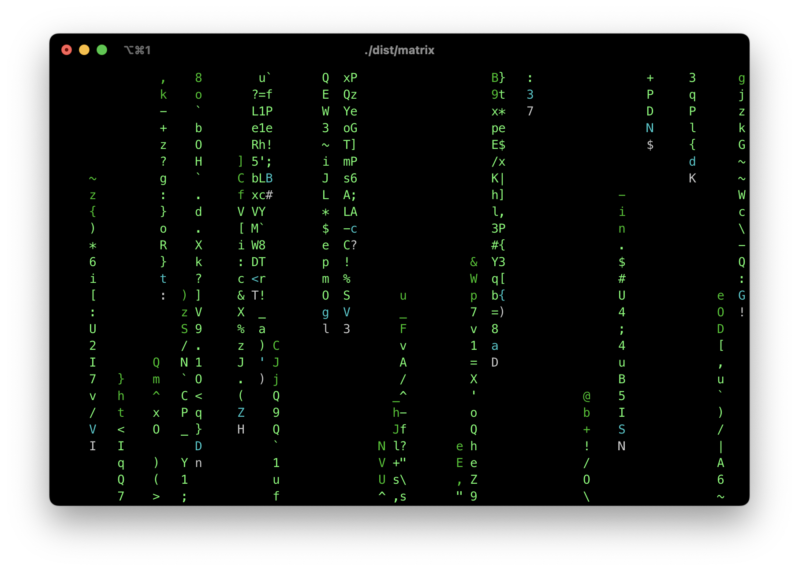
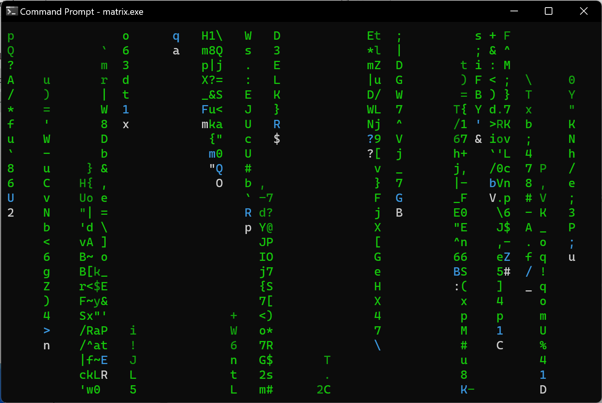
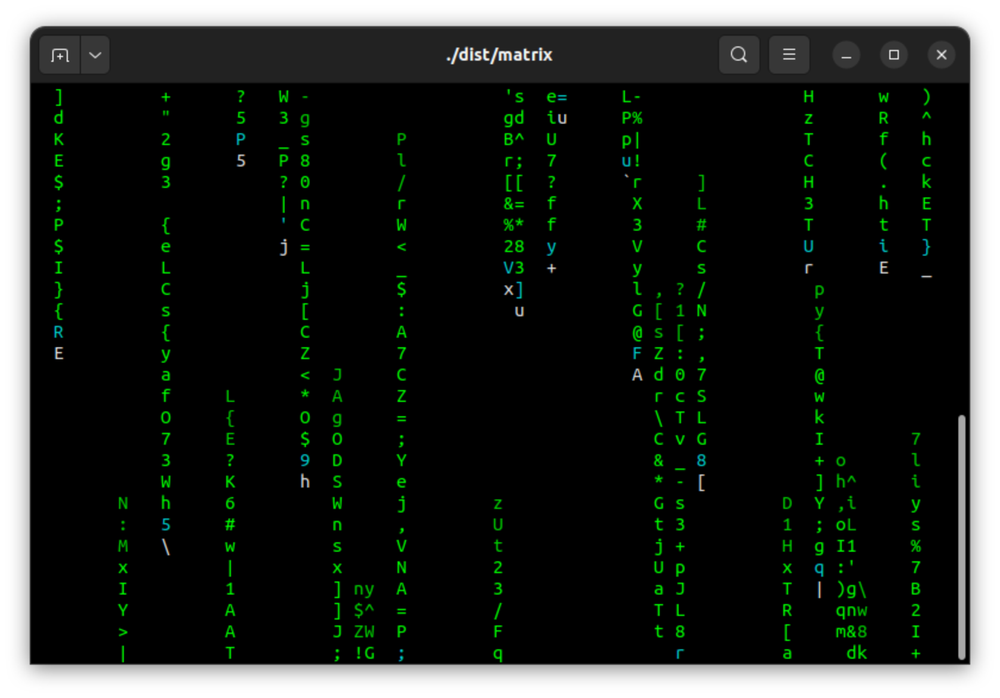
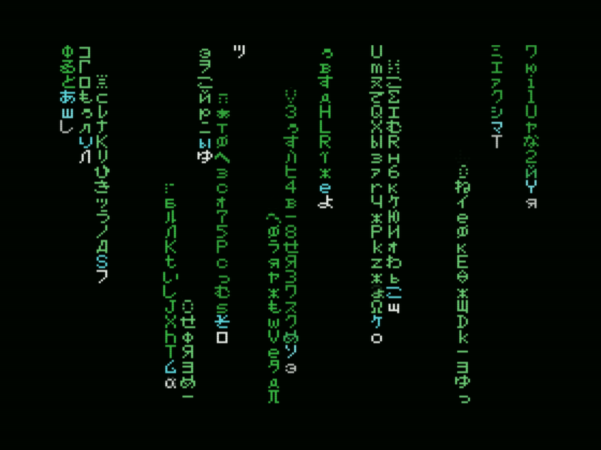

# Simulating the Iconic Digital Rain Effect from "The Matrix" in C and Assembly

_Gilbert François Duivesteijn_


## About

Welcome to an exploration of the iconic digital rain effect, inspired by the mesmerizing visuals from the renowned movie "The Matrix." In this program dives into the realm of C and Assembly programming to recreate the enigmatic cascade of characters that captured the imagination of audiences worldwide.

The digital rain, a cascade of green characters raining down the screen, has become an emblematic symbol synonymous with futuristic aesthetics. Recreating this effect in C and Assembly allows us to not only pay homage to a cinematic marvel but also delve into the artistry of programming. Through careful manipulation of terminal output, we simulate the immersive and captivating visual experience reminiscent of the Matrix's iconic scenes.

|    |  |
| ----------------------------------------- | ------------------------------------------- |
| *iTerm on macOS*                          | *CMD on Windows*                            |
|  |    |
| *Terminal on Linux*                       | MSX (implementation in assembly)            |


## Compatibility

The C program boasts versatile compatibility, seamlessly running on a multitude of operating systems including macOS, Linux, Raspberry Pi OS and Windows. Its design is tailored to function effortlessly with nearly every standard C99 compiler available across these platforms. Whether compiling on macOS, Linux distributions, or Windows environments, this program ensures a consistent and reliable execution across diverse systems without compromise.

The MSX code is written for MSX1 and fully compatible with MSX2 and higher. 


## Build and run the C version

### Linux and macOS:

```
git clone https://github.com/gilbertfrancois/terminal-art-the-matrix.git
cd terminal-art-the-matrix

cmake -B build -S .
cmake --build build
cmake --install build

# Run:
cd dist
./matrix
```


### Windows with Visual Studio 2022:

- Clone the repository and open the folder as project.
- Cmake will automatically add the debug and install target.
- Choose from the menu **Build** -> **Build all**. The binary can be found in `<project_folder>/dist`.


### Precompiled binaries

The [Releases](https://github.com/gilbertfrancois/terminal-art-the-matrix/releases) page contains precompiled binaries for most popular supported systems.


### Code signing on macOS

This project contains an easy way to do code signing for your distribution binary on macOS. 

- Set up your developer's ID as an environment variable named `CODE_SIGN_IDENTITY`. This variable typically holds the identity of your Developer ID Application, including your name and the Developer ID number, e.g.

  ```sh
  export CODE_SIGN_IDENTITY="Developer ID Application: [your name] (DEV_ID_NUMBER)"
  ```

- Use CMake to build the project with the `Release` build flag. This ensures that the compiled binary is optimized for distribution:

  ```sh
  cmake -S . -B build -DCMAKE_BUILD_TYPE=Release
  cmake --build build
  cmake --install build
  ```

- Upon successful signing, you'll receive a verbose response. Look for a message indicating that the binary has replaced an existing signature and that it's been signed, usually accompanied by the path to the binary and its signing status (e.g., "signed Mach-O thin").


## Build and run the Z80 assembly version

To compile the code, follow the steps below:

- Install [VASM](http://www.compilers.de/vasm.html) assembler. There is an install script in `asm/bin/install_vasm.sh`. Then type:

- ```sh
  cd <project folder>/asm
  make
  ```

- The compiled binaries are located in `asm/dist/matrix.bin` (for MSX-Basic environment) and `asm/dist/matrix.com` for MSX-DOS. Copy the binary on a floppy drive for your MSX.

- Start the bin version with: 

  ```sh
  bload"matrix.bin",r
  ```

​	or the MSX-DOS version with typing `matrix` in the DOS prompt.

When you don't own a MSX computer, you can use an emulator like [openMSX](https://openmsx.org/).


### Precompiled binary for MSX

If you don't like the hassle of compiling it yourself, then go to the [Releases](https://github.com/gilbertfrancois/terminal-art-the-matrix/releases) page and download the precompiled binary for the MSX system.


## References

- [Hackaday project page](https://hackaday.io/project/193853-the-matrix-digital-rain-effect-in-c-and-asm)
- [Journey into MSX Z80 Assembly programming](https://gilbertfrancois.github.io)

- [Programming the Z80, Zaks](https://www.amazon.com/Programming-Z80-Rodnay-Zaks/dp/0895880695)

- [Learn Multiplatform Assembly Programming with ChibiAkumas, Volume 1](https://www.amazon.com/Learn-Multiplatform-Assembly-Programming-ChibiAkumas/dp/B08W7DWZB3/)

- [Learn Multiplatform Assembly Programming with ChibiAkumas, Volume 2](https://www.amazon.com/Learn-Multiplatform-Assembly-Programming-ChibiAkumas/dp/B09VWHYDKJ/)

  
