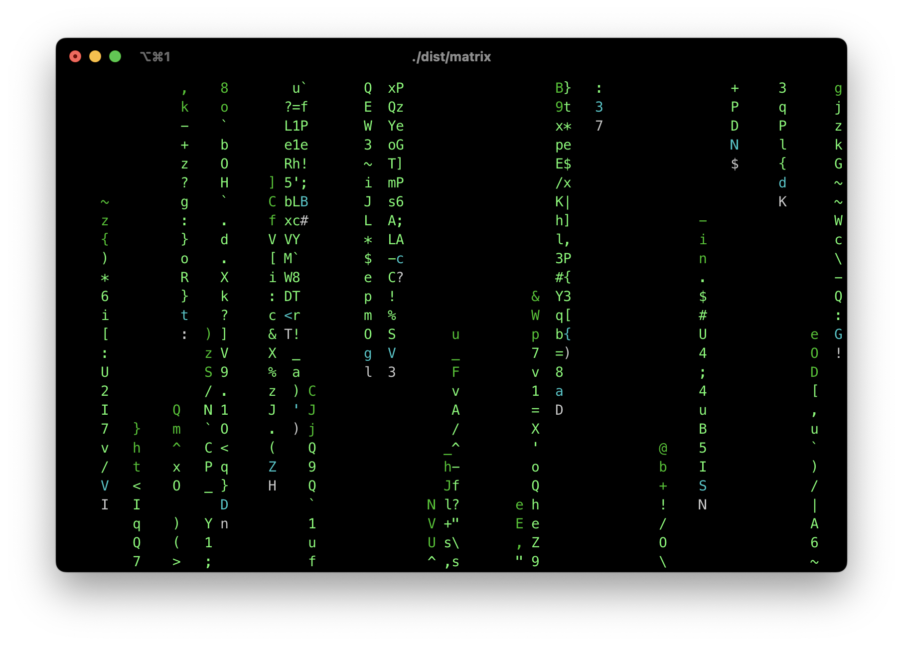
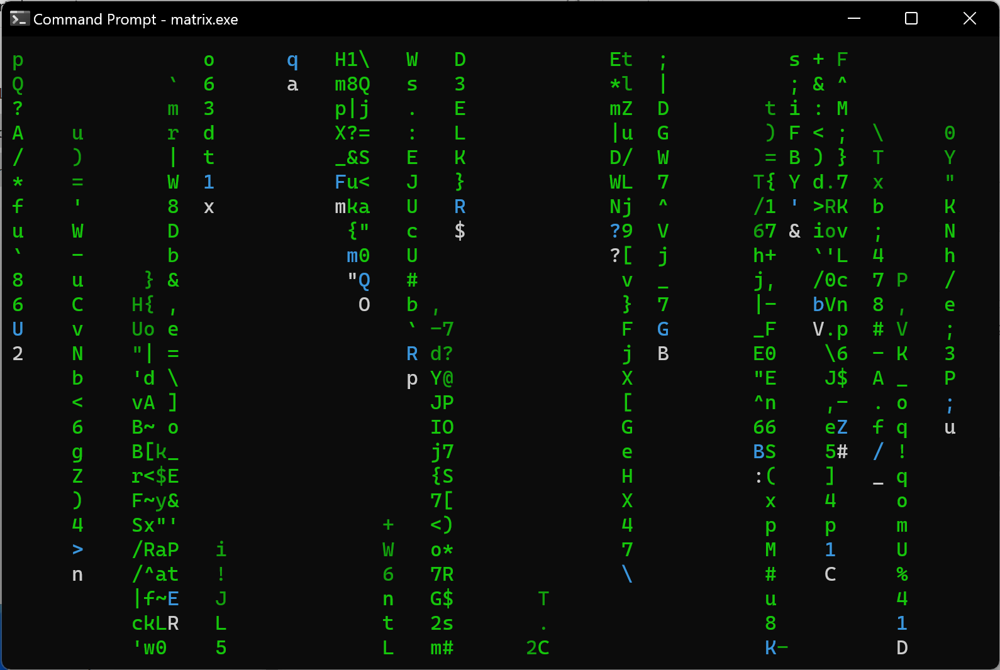
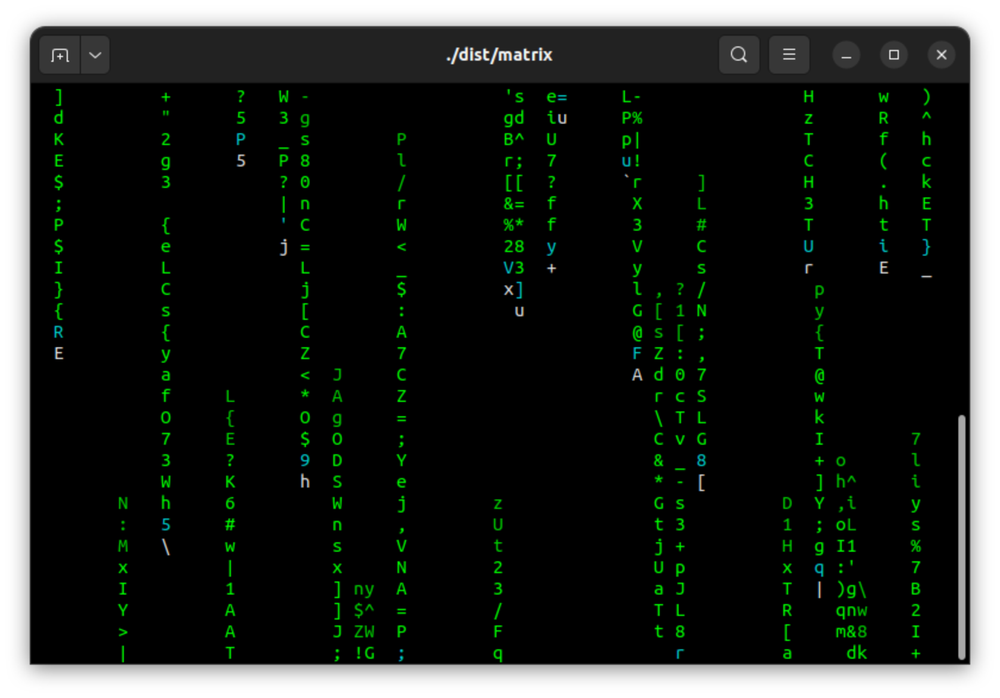

# Simulating the Iconic Digital Rain Effect from "The Matrix" in C

_Gilbert François Duivesteijn_


## About

Welcome to an exploration of the iconic digital rain effect, inspired by the mesmerizing visuals from the renowned movie "The Matrix." In this program dives into the realm of C programming to recreate the enigmatic cascade of characters that captured the imagination of audiences worldwide.

The digital rain, a cascade of green characters raining down the screen, has become an emblematic symbol synonymous with futuristic aesthetics. Recreating this effect in C allows us to not only pay homage to a cinematic marvel but also delve into the artistry of programming. Through careful manipulation of terminal output, we simulate the immersive and captivating visual experience reminiscent of the Matrix's iconic scenes.

|  |  |  |
| -------------------------------------- | ------------------------------------------ | ---------------------------------------- |
| *iTerm on macOS*                       | *CMD on Windows*                           | *Terminal on Linux*                      |


## Leveraging xterm-Compatible Terminal Escape Codes for Colorful Effects

Terminal escape codes, especially those compatible with xterm, offer a powerful means to introduce colors and formatting into terminal-based applications. In C programming, you can utilize these escape codes to enhance the visual appeal of your digital rain effect or any terminal-based output.

For xterm-compatible terminals, you can employ ANSI escape codes, which are a standardized way to control text formatting, color, cursor movement, and other display options within the terminal.

To introduce colors using ANSI escape codes in C, you can incorporate specific sequences before the text you want to colorize. For instance, to change the text color to green, you'd use the escape code `"\033[32m"` before the text and `"\033[0m"` to reset the color back to default.


## Compatibility

This program boasts versatile compatibility, seamlessly running on a multitude of operating systems including macOS, Linux, Raspberry Pi OS and Windows. Its design is tailored to function effortlessly with nearly every standard C99 compiler available across these platforms. Whether compiling on macOS, Linux distributions, or Windows environments, this program ensures a consistent and reliable execution across diverse systems without compromise.


## Build and run

### Linux and macOS:

```
git clone https://github.com/gilbertfrancois/terminal-art-the-matrix.git
cd terminal-art-the-matrix

cmake -B build -S .
cmake --build build
cmake --install build

# Run:
cd dist
./matrix
```


### Windows with Visual Studio 2022:

- Clone the repository and open the folder as project.
- Cmake will automatically add the debug and install target.
- Choose from the menu **Build** -> **Build all**. The binary can be found in `<project_folder>/dist`.


## Precompiled binaries

The [Releases](https://github.com/gilbertfrancois/terminal-art-the-matrix/releases) page contains precompiled binaries for most popular supported systems.


## Code signing on macOS

This project contains an easy way to do code signing for your distribution binary on macOS. 

- Set up your developer's ID as an environment variable named `CODE_SIGN_IDENTITY`. This variable typically holds the identity of your Developer ID Application, including your name and the Developer ID number, e.g.

  ```sh
  export CODE_SIGN_IDENTITY="Developer ID Application: [your name] (DEV_ID_NUMBER)"
  ```

- Use CMake to build the project with the `Release` build flag. This ensures that the compiled binary is optimized for distribution:

  ```sh
  cmake -S . -B build -DCMAKE_BUILD_TYPE=Release
  cmake --build build
  cmake --install build
  ```

- Upon successful signing, you'll receive a verbose response. Look for a message indicating that the binary has replaced an existing signature and that it's been signed, usually accompanied by the path to the binary and its signing status (e.g., "signed Mach-O thin").