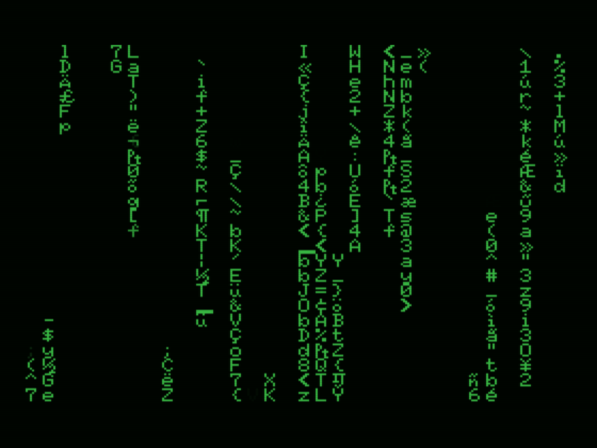

# Simulating the Iconic Digital Rain Effect from "The Matrix" in C and Assembly

_Gilbert François Duivesteijn_


## About

Welcome to an exploration of the iconic digital rain effect, inspired by the mesmerizing visuals from the renowned movie "The Matrix." In this program dives into the realm of C and Assembly programming to recreate the enigmatic cascade of characters that captured the imagination of audiences worldwide.

The digital rain, a cascade of green characters raining down the screen, has become an emblematic symbol synonymous with futuristic aesthetics. Recreating this effect in C and Assembly allows us to not only pay homage to a cinematic marvel but also delve into the artistry of programming. Through careful manipulation of terminal output, we simulate the immersive and captivating visual experience reminiscent of the Matrix's iconic scenes.

|    |  |
| ----------------------------------------- | ------------------------------------------- |
| *iTerm on macOS*                          | *CMD on Windows*                            |
|  |          |
| *Terminal on Linux*                       | MSX                                         |


## Follow the white rabbit...

The provided C implementation is quite low level as it operates without the assistance of higher-level libraries, interacting directly with the terminal to create the digital rain effect. However, taking it to an even deeper level involves crafting a version in assembly language specifically tailored for the Z80 processor, targeting the remarkable MSX computers from the 80s.

In the C version, the absence of libraries like ncurses means the code manages the raindrop animation logic at a lower level, interacting more directly with the terminal's output. Despite this, diving into Z80 assembly for the MSX goes even further by sidestepping any operating system or libraries, enabling direct manipulation of the hardware registers and memory addresses that control the MSX's Video Display Processor (VDP) responsible for rendering graphics.

Creating the effect in Z80 assembly language for the MSX entails:

1. **Hardware Interaction**: Directly addressing the VDP registers to control screen memory, character rendering, and display output.
2. **Memory Management**: Allocating and managing memory for screen buffers, characters, and other essential data structures needed for animation.
3. **Precise Timing**: Ensuring precise timing for screen updates and character movements to maintain a smooth and captivating animation.
4. **Input/Output Handling**: If necessary, managing input devices and handling interrupts at a more intricate level than in higher-level languages.
5. **Optimizations**: Crafting highly optimized code to maximize performance within the constraints and capabilities of the MSX hardware.

Working in Z80 assembly for the MSX delves deep into the hardware specifics of the system, offering unparalleled control over its functionalities. This level of programming requires an intimate understanding of the MSX architecture, Z80 assembly language, and the intricacies of the Video Display Processor unique to the MSX platform.

Overall, the leap from the C implementation to Z80 assembly for the MSX represents a significant shift toward a lower level of programming, allowing for an intricate and precise control over the system's hardware, ultimately resulting in a more optimized and customized digital rain effect.


## Compatibility

The C program boasts versatile compatibility, seamlessly running on a multitude of operating systems including macOS, Linux, Raspberry Pi OS and Windows. Its design is tailored to function effortlessly with nearly every standard C99 compiler available across these platforms. Whether compiling on macOS, Linux distributions, or Windows environments, this program ensures a consistent and reliable execution across diverse systems without compromise.


## Build and run the C version

### Linux and macOS:

```
git clone https://github.com/gilbertfrancois/terminal-art-the-matrix.git
cd terminal-art-the-matrix

cmake -B build -S .
cmake --build build
cmake --install build

# Run:
cd dist
./matrix
```


### Windows with Visual Studio 2022:

- Clone the repository and open the folder as project.
- Cmake will automatically add the debug and install target.
- Choose from the menu **Build** -> **Build all**. The binary can be found in `<project_folder>/dist`.


### Precompiled binaries

The [Releases](https://github.com/gilbertfrancois/terminal-art-the-matrix/releases) page contains precompiled binaries for most popular supported systems.


### Code signing on macOS

This project contains an easy way to do code signing for your distribution binary on macOS. 

- Set up your developer's ID as an environment variable named `CODE_SIGN_IDENTITY`. This variable typically holds the identity of your Developer ID Application, including your name and the Developer ID number, e.g.

  ```sh
  export CODE_SIGN_IDENTITY="Developer ID Application: [your name] (DEV_ID_NUMBER)"
  ```

- Use CMake to build the project with the `Release` build flag. This ensures that the compiled binary is optimized for distribution:

  ```sh
  cmake -S . -B build -DCMAKE_BUILD_TYPE=Release
  cmake --build build
  cmake --install build
  ```

- Upon successful signing, you'll receive a verbose response. Look for a message indicating that the binary has replaced an existing signature and that it's been signed, usually accompanied by the path to the binary and its signing status (e.g., "signed Mach-O thin").


## Build and run the Z80 assembly version

- Install [VASM](http://www.compilers.de/vasm.html) assembler. There is an install script in `asm/bin/install_vasm.sh`.

- ```sh
  cd asm
  make
  ```

- The binary is located in `asm/dist/matrix.bin`.

- Put it on a floppy disk and load it in your MSX with

  ```sh
  bload"matrix.bin",r
  ```

When you don't own a MSX computer, you can use an emulator like [openMSX](https://openmsx.org/).


### Precompiled binary for MSX

If you don't like the hassle of compiling it yourself, then go to the [Releases](https://github.com/gilbertfrancois/terminal-art-the-matrix/releases) page and download the precompiled binary for the MSX system.

